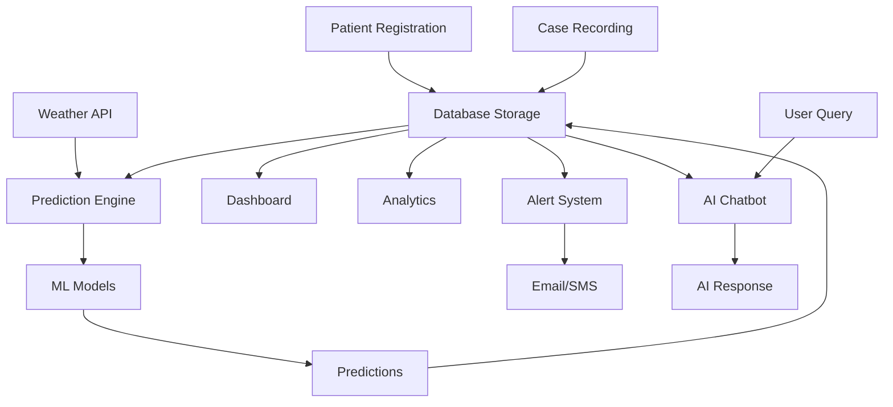

# 🏥 ASCLEPIUS - Dengue Surveillance and Monitoring System

## 📋 Project Overview

**ASCLEPIUS** is a comprehensive web-based dengue surveillance and monitoring system designed for local government health authorities in Tupi, South Cotabato, Philippines. The system provides real-time tracking, predictive analytics, automated alerts, and AI-powered assistance for dengue outbreak management at the barangay (village) level.

### 🎯 Purpose
- Monitor dengue cases across multiple barangays in real-time
- Predict potential outbreaks using weather correlation and machine learning
- Automate health alerts to barangay officials
- Provide data-driven insights for public health decision-making
- Enable AI-assisted dengue information and guidance

---

## 🏗️ System Architecture

### Technology Stack

#### Backend
- **Language**: PHP 8.x
- **Database**: MySQL/MariaDB (asclpe_db)
- **Server**: Apache (XAMPP)
- **Authentication**: Session-based authentication
- **API Integration**: RESTful endpoints

#### Frontend
- **HTML5/CSS3**: Responsive web design
- **JavaScript**: Dynamic interactions and AJAX
- **Bootstrap**: UI framework
- **Chart.js**: Data visualization
- **Leaflet.js**: Interactive mapping with GeoJSON

#### External Services & APIs
- **Google Gemini AI**: AI-powered chatbot and natural language processing
- **Open-Meteo API**: Weather data for prediction models
- **SMTP2GO**: Email notification service
- **Infobip**: SMS messaging (configured)

#### Dependencies (Composer)
- **GuzzleHTTP**: HTTP client for API requests
- **FPDF**: PDF generation for reports

---

## 🎨 Core Features

### 1. 📊 Real-Time Dashboard
**File**: [dashboard.php](dashboard.php)

- Live statistics on dengue cases (total, monthly, active, recovered)
- Trend analysis with percentage changes
- Geographic heat map showing case distribution across barangays
- Recent cases timeline
- Active alerts panel
- Risk level indicators

**Data Displayed**:
- Total Cases
- Active Cases
- Recovered Cases
- Monthly Trends
- Case Fatality Rate
- Risk Assessment per Barangay

### 2. 👥 Patient Management
**Files**: [patients.php](patients.php), [add_patient.php](add_patient.php), [edit_case_new.php](edit_case_new.php), [view_patient.php](view_patient.php)

**Features**:
- Register new patients with personal information
- Track patient demographics (name, age, gender, contact, address)
- Assign patients to specific barangays
- Search and filter patient records
- Sort by name, age, barangay, status, or date
- View complete patient case history
- Edit and update patient information
- Delete patient records (with cascade to cases)

**Patient Data Fields**:
- First Name & Last Name
- Date of Birth (auto-calculates age)
- Gender
- Contact Number
- Address
- Barangay Assignment
- Date Registered

### 3. 🩺 Case Management
**Files**: [add_case.php](add_case.php), [edit_case_new.php](edit_case_new.php), [delete_case.php](delete_case.php), [export_case_history.php](export_case_history.php)

**Features**:
- Record dengue cases for registered patients
- Track case severity and status
- Monitor symptoms and vital signs
- Document treatment and outcomes
- Export case history to PDF

**Case Data Fields**:
- Date Reported
- Case Status (Mild, Moderate, Severe, Critical, Recovered, Deceased)
- Temperature (fever monitoring)
- Symptoms checklist
- Treatment administered
- Hospital admission status
- Recovery date

### 4. 📈 Analytics & Reporting
**Files**: [analytics.php](analytics.php), [export_analytics_pdf.php](export_analytics_pdf.php)

**Features**:
- Comprehensive barangay-level statistics
- Time-series analysis of case trends
- Age group distribution
- Gender analysis
- Status breakdown (mild, moderate, severe, critical)
- Case incidence rates per population
- Peak season identification
- Geographic risk mapping
- CSV export for external analysis
- PDF report generation

**Analytics Metrics**:
- Cases per barangay
- Population-adjusted case rates
- Case severity distribution
- Recovery rates
- Average temperature trends
- Unique patient counts
- First vs. repeat cases

### 5. 🔮 Prediction System
**Files**: [prediction.php](prediction.php), [barangay_prediction_data.php](barangay_prediction_data.php), [api/save_prediction.php](api/save_prediction.php)

**Features**:
- 16-day dengue case predictions
- Weather-based correlation analysis
- Historical data comparison (up to 90 days)
- Multiple regression models
- Barangay-specific predictions
- Risk level forecasting
- Save predictions to database

**Prediction Models**:
1. **Weather Correlation Model**
   - Temperature correlation
   - Humidity correlation
   - Rainfall correlation
   - Weather code analysis

2. **Linear Regression**
   - Historical case trends
   - Seasonal patterns
   - Growth rate analysis

3. **Moving Average**
   - 7-day moving average
   - 14-day moving average
   - Trend smoothing

**Weather Data Integration**:
- Source: Open-Meteo API
- Coordinates: Tupi, South Cotabato (6.2167°N, 124.9500°E)
- Parameters tracked:
  - Temperature (max/min)
  - Humidity
  - Precipitation
  - Weather codes
- Timezone: Asia/Manila (PHT)

### 6. 🤖 AI Assistant & Chatbot
**Files**: [ai_agent.php](ai_agent.php), [chatbot/chatbot.php](chatbot/chatbot.php), [api/local_dengue_assistant.php](api/local_dengue_assistant.php), [api/gemini_proxy.php](api/gemini_proxy.php)

**Features**:
- Natural language interaction
- Real-time dengue data queries
- Prevention tips and guidance
- Symptom assessment
- Treatment recommendations
- Risk assessment
- Public health advice

**AI Backend**:
- **Primary**: Google Gemini Pro API
- **Fallback**: Rule-based local assistant (offline mode)
- Context-aware responses using live database data

**Chatbot Capabilities**:
- Case summary by barangay
- Recent trends analysis
- High-risk area identification
- Prevention recommendations
- Symptom checker
- When to seek medical care
- Historical data queries

### 7. 🚨 Alert System
**Files**: [alerts.php](alerts.php), [automatic_alert_monitor.php](automatic_alert_monitor.php)

**Features**:
- Automated threshold monitoring
- Email alerts to barangay officials
- Manual alert dispatch
- Alert history tracking
- Configurable thresholds
- Official contact management

**Alert Triggers**:
- 7-day case threshold exceeded
- 24-hour spike detection
- Severe case threshold
- Critical case notification
- Outbreak declaration criteria

**Notification Methods**:
- **Email**: SMTP2GO integration
- **SMS**: Infobip configuration (available)
- **In-App**: Dashboard notifications

**Alert Settings**:
- Case threshold (7 days)
- Case threshold (24 hours)
- Severe case threshold
- Auto-email enabled/disabled
- Email frequency (hours)

**Barangay Officials Management**:
- Add/Edit/Delete officials
- Contact information (email/phone)
- Position/Title
- Barangay assignment
- Active/Inactive status

### 8. 🗺️ Geographic Visualization
**Files**: GeoJSON data in [assets/geojson/](assets/geojson/), Leaflet.js integration

**Features**:
- Interactive map of Tupi municipality
- Barangay boundaries (GeoJSON)
- Color-coded risk levels
- Case count markers
- Population density overlay
- Click for detailed barangay stats

**Map Data**:
- Barangay coordinates (latitude/longitude)
- Population data
- Case distribution
- Risk levels (low, moderate, high, critical)

### 9. 📤 Export & Reporting
**Files**: [export_analytics_pdf.php](export_analytics_pdf.php), [export_patient_pdf.php](export_patient_pdf.php), [export_case_history.php](export_case_history.php), [export_database.php](export_database.php), [simple_export.php](simple_export.php)

**Export Formats**:
- **PDF**: Professional reports with charts and tables
- **CSV**: Raw data for Excel/analysis
- **SQL**: Complete database backup

**Report Types**:
- Analytics summary reports
- Patient case history
- Barangay-specific reports
- Time-range filtered reports
- Database exports with metadata

---

## 🗄️ Database Structure

### Core Tables

#### `users`
- User authentication and profile
- Fields: user_id, username, password (hashed), email, role

#### `barangays`
- Geographic administrative units
- Fields: barangay_id, name, population, latitude, longitude, risk_level

#### `patients`
- Patient demographics and registration
- Fields: patient_id, first_name, last_name, date_of_birth, gender, contact_number, address, barangay_id, date_registered

#### `patient_cases`
- Individual dengue case records
- Fields: case_id, patient_id, date_reported, status, temperature, symptoms, treatment, recovery_date

#### `predictions`
- ML-generated dengue predictions
- Fields: prediction_id, barangay_id, prediction_date, predicted_cases, confidence_level, weather_data

#### `alerts`
- System-generated and manual alerts
- Fields: alert_id, alert_type, severity, message, date_created, status, barangay_id

#### `alert_settings`
- Configurable alert thresholds
- Fields: setting_id, setting_name, setting_value

#### `barangay_officials`
- Contact information for health officials
- Fields: official_id, barangay_id, name, position, email, phone, is_active

#### `weather_data`
- Historical weather records
- Fields: weather_id, date, temperature, humidity, precipitation, weather_code

---

## 📁 Project Structure

```
asclpe/
│
├── 🌐 Main Pages
│   ├── login.php              # User authentication
│   ├── logout.php             # Session termination
│   ├── dashboard.php          # Main dashboard
│   ├── patients.php           # Patient listing
│   ├── add_patient.php        # New patient form
│   ├── view_patient.php       # Patient details
│   ├── add_case.php           # New case form
│   ├── edit_case_new.php      # Case editing
│   ├── delete_case.php        # Case removal
│   ├── delete_patient.php     # Patient removal
│   ├── analytics.php          # Analytics dashboard
│   ├── prediction.php         # Prediction engine
│   ├── alerts.php             # Alert management
│   ├── ai_agent.php           # AI assistant interface
│   └── profile.php            # User profile
│
├── 📡 API Endpoints
│   ├── api/
│   │   ├── dashboard-data.php         # Dashboard data API
│   │   ├── save_prediction.php        # Save predictions
│   │   ├── gemini_proxy.php           # AI API proxy
│   │   ├── local_dengue_assistant.php # Offline chatbot
│   │   └── chatbot_data.php           # Chatbot data
│
├── 🎨 Assets
│   ├── assets/
│   │   ├── css/               # Stylesheets
│   │   ├── js/                # JavaScript files
│   │   └── geojson/           # Map data
│
├── 🔧 Configuration
│   ├── includes/
│   │   ├── config.php         # Database & core functions
│   │   ├── auth.php           # Authentication logic
│   │   ├── smtp_config.php    # Email configuration
│   │   ├── simple_smtp2go.php # Email sender
│   │   └── infobip_config.php # SMS configuration
│
├── 🗄️ Database
│   ├── database/
│   │   ├── schema.sql         # Database schema
│   │   └── prediction_tables.sql # Prediction tables
│
├── 📚 Setup & Documentation
│   ├── setup/
│   │   ├── AI_Decision_Guide.md           # AI implementation guide
│   │   ├── SMTP2GO_SETUP.md               # Email setup guide
│   │   ├── dengue_ai_workflow.json        # AI workflow config
│   │   ├── setup_prediction_tables.php    # DB setup script
│   │   └── test_patients_data.sql         # Test data
│
├── 📄 Documentation
│   ├── docs/
│   │   ├── ASCLEPIUS_System_Flowchart.md # System flow diagrams
│   │   └── weather_annotations.md         # Weather data notes
│
├── 🤖 Chatbot
│   └── chatbot/
│       └── chatbot.php        # Chatbot interface
│
├── 📊 Data Management
│   ├── import_historical_data_part1.php
│   ├── import_complete_historical_data.php
│   ├── setup_historical_data.php
│   ├── setup_historical_predictions.php
│   ├── consolidate_population.php
│   ├── update_2025_population.php
│   └── barangay_prediction_data.php
│
├── 🐛 Diagnostics & Testing
│   ├── target_laptop_diagnostics.php
│   ├── test_open_meteo.php
│   ├── check_barangay_names.php
│   ├── diagnose_patient_issue.php
│   ├── debug_add_patient.php
│   └── final_verification.php
│
├── 📤 Export Tools
│   ├── export_database.php
│   ├── export_analytics_pdf.php
│   ├── export_patient_pdf.php
│   ├── export_case_history.php
│   └── simple_export.php
│
└── 📦 Dependencies
    └── vendor/              # Composer packages
```

---

## 🔄 System Workflow

### 1️⃣ User Authentication
```
Login Page → Credential Verification → Session Creation → Dashboard Access
```

### 2️⃣ Patient Registration & Case Recording
```
Add Patient → Select Barangay → Save to Database
↓
Add Case → Link to Patient → Record Symptoms & Status → Automatic Alert Check
```

### 3️⃣ Real-Time Monitoring
```
Database → Dashboard API → Live Statistics → Map Visualization
↓
Alert System Monitors Thresholds → Email Notifications to Officials
```

### 4️⃣ Prediction Generation
```
Fetch Weather Data (Open-Meteo) → Historical Case Data → Apply ML Models
↓
Generate 16-day Forecast → Display Predictions → Save to Database
```

### 5️⃣ AI Interaction
```
User Query → Fetch Current Data → Send to Gemini API → Process Response
↓
Display AI-Generated Answer with Context
```

---

## 🔐 Security Features

- **Authentication**: Session-based login system
- **Password Security**: Hashed passwords (recommended: bcrypt/password_hash)
- **SQL Injection Prevention**: PDO prepared statements throughout
- **XSS Protection**: Output sanitization
- **CSRF Protection**: Session token validation (recommended)
- **Access Control**: Role-based permissions
- **API Security**: API key management for external services

---

## 🌐 API Integrations

### Google Gemini AI
- **Purpose**: Natural language processing for chatbot
- **Endpoint**: `https://generativelanguage.googleapis.com/v1beta/models/gemini-pro:generateContent`
- **Authentication**: API Key
- **Usage**: Dengue information queries, prediction explanations, health guidance

### Open-Meteo Weather API
- **Purpose**: Weather data for prediction models
- **Endpoint**: `https://api.open-meteo.com/v1/forecast`
- **Authentication**: None (free public API)
- **Data**: Temperature, humidity, precipitation, weather codes
- **Location**: Tupi, South Cotabato (6.2167°N, 124.9500°E)
- **Forecast Range**: Up to 16 days

### SMTP2GO
- **Purpose**: Reliable email delivery for alerts
- **Configuration**: [includes/smtp_config.php](includes/smtp_config.php)
- **Usage**: Automated alert emails to barangay officials

### Infobip (Optional)
- **Purpose**: SMS notifications
- **Configuration**: [includes/infobip_config.php](includes/infobip_config.php)
- **Status**: Configured but optional

---

## 📊 Data Flow



---

## 🚀 Key Functionalities

### Dashboard Features
✅ Real-time case statistics  
✅ Geographic heat maps  
✅ Trend analysis with percentages  
✅ Active alerts panel  
✅ Recent cases timeline  
✅ Risk level indicators  

### Patient Management
✅ CRUD operations (Create, Read, Update, Delete)  
✅ Advanced search and filtering  
✅ Barangay assignment  
✅ Age calculation from birthdate  
✅ Case history tracking  
✅ Contact information management  

### Analytics Capabilities
✅ Multi-dimensional analysis  
✅ Time-series visualization  
✅ Geographic distribution  
✅ Demographic breakdowns  
✅ Population-adjusted rates  
✅ Export to PDF and CSV  

### Prediction System
✅ 16-day forecast generation  
✅ Weather correlation analysis  
✅ Multiple regression models  
✅ Confidence scoring  
✅ Historical comparison  
✅ Barangay-specific predictions  

### Alert Management
✅ Automated threshold monitoring  
✅ Configurable alert rules  
✅ Multi-channel notifications (email/SMS)  
✅ Official contact management  
✅ Alert history and tracking  
✅ Manual alert dispatch  

### AI Assistant
✅ Natural language queries  
✅ Context-aware responses  
✅ Real-time data integration  
✅ Offline fallback mode  
✅ Dengue prevention guidance  
✅ Symptom assessment  

---

## 🎓 Use Cases

### 1. Rural Health Unit (RHU) Officer
**Scenario**: Monitor dengue cases across all barangays
- Access dashboard for real-time statistics
- View geographic distribution on map
- Identify high-risk barangays
- Generate reports for municipal health office

### 2. Barangay Health Worker (BHW)
**Scenario**: Register new dengue case
- Add patient information
- Record symptoms and vital signs
- Assign case severity
- System automatically checks thresholds and sends alerts

### 3. Municipal Health Officer (MHO)
**Scenario**: Assess outbreak risk
- Review prediction forecasts
- Analyze weather correlation
- Export detailed analytics
- Make data-driven resource allocation decisions

### 4. Data Analyst
**Scenario**: Generate quarterly report
- Filter data by date range
- Export CSV for analysis in Excel
- Generate PDF reports with charts
- Share insights with stakeholders

### 5. Concerned Citizen
**Scenario**: Learn about dengue prevention
- Interact with AI chatbot
- Ask about symptoms
- Get prevention tips
- Check current case trends in their barangay

---

## 🛠️ Technical Requirements

### Server Requirements
- **Web Server**: Apache 2.4+ (XAMPP recommended)
- **PHP**: 8.0 or higher
- **Database**: MySQL 5.7+ or MariaDB 10.3+
- **Memory**: 512 MB minimum (1 GB recommended)
- **Storage**: 1 GB minimum for application + database

### PHP Extensions Required
- `pdo_mysql` - Database connectivity
- `curl` - API requests
- `json` - JSON handling
- `mbstring` - String functions
- `openssl` - Secure communications
- `gd` or `imagick` - Image processing (optional)

### Composer Packages
```json
{
    "require": {
        "guzzlehttp/guzzle": "^7.0",
        "fpdf/fpdf": "^1.8"
    }
}
```

### Browser Compatibility
- Chrome 90+
- Firefox 88+
- Safari 14+
- Edge 90+

---

## 🌟 Unique Features

1. **Hyperlocal Tracking**: Barangay-level granularity for precise monitoring
2. **Weather Integration**: First-of-its-kind weather-dengue correlation for rural Philippines
3. **AI-Powered Insights**: Gemini AI provides contextual dengue information
4. **Offline Capability**: Local rule-based chatbot works without internet
5. **Automated Alerts**: Proactive notification to prevent outbreaks
6. **Multi-Model Predictions**: Combines multiple ML approaches for accuracy
7. **Population-Adjusted Metrics**: Fair comparison across different-sized barangays
8. **Visual Risk Assessment**: Color-coded maps for quick situation awareness

---

## 🎯 Target Deployment

### Geographic Scope
- **Municipality**: Tupi, South Cotabato
- **Region**: SOCCSKSARGEN (Region XII), Philippines
- **Barangays**: All barangays in Tupi municipality

### Target Users
- Municipal Health Office (MHO)
- Rural Health Unit (RHU) staff
- Barangay Health Workers (BHWs)
- Municipal Disaster Risk Reduction and Management Office (MDRRMO)
- Local Government Unit (LGU) officials

---

## 📈 Data-Driven Decision Making

The system enables evidence-based public health interventions:

1. **Early Warning**: Predictions allow proactive resource deployment
2. **Resource Allocation**: Identify high-risk barangays needing urgent attention
3. **Trend Analysis**: Understand seasonal patterns and outbreak cycles
4. **Impact Assessment**: Measure effectiveness of interventions
5. **Reporting**: Generate reports for DOH (Department of Health) compliance

---

## 🔮 Future Enhancement Opportunities

### Potential Features
- Mobile application (iOS/Android)
- SMS-based case reporting for BHWs
- Integration with national DOH systems
- Machine learning model retraining with local data
- Mosquito breeding site mapping
- Fogging schedule optimization
- Patient follow-up reminders
- Community-level data visualization
- Multi-disease monitoring (add malaria, leptospirosis, etc.)
- API for third-party integrations

### Scalability
- Expandable to multiple municipalities
- Replicable across other disease surveillance needs
- Can integrate with national health information systems

---

## 📝 Project Status

**Current Version**: Production-ready  
**Last Updated**: February 2026  
**Status**: Active deployment in Tupi, South Cotabato  

---

## 📞 System Components Summary

| Component | Technology | Purpose |
|-----------|-----------|---------|
| Backend | PHP 8.x | Server-side logic |
| Database | MySQL/MariaDB | Data persistence |
| Frontend | HTML/CSS/JS | User interface |
| Maps | Leaflet.js | Geographic visualization |
| Charts | Chart.js | Data visualization |
| AI | Google Gemini | Chatbot intelligence |
| Weather | Open-Meteo API | Prediction data |
| Email | SMTP2GO | Alert notifications |
| PDF | FPDF | Report generation |
| HTTP Client | Guzzle | API communication |

---

## 🏆 Project Significance

ASCLEPIUS represents a modern approach to public health surveillance in rural Philippines, combining:
- **Traditional epidemiology** with machine learning
- **Local knowledge** with global technology
- **Proactive prevention** with reactive response
- **Community engagement** with professional healthcare

This system empowers local health authorities with enterprise-grade tools previously only available to large urban centers, democratizing access to advanced health informatics.

---

## 📄 License & Usage

This system was developed for public health purposes in Tupi, South Cotabato. The implementation demonstrates the potential of digital health solutions in resource-constrained settings.

---

## 🙏 Acknowledgments

- **Local Government Unit of Tupi** - Leadership and support
- **Municipal Health Office** - Domain expertise and requirements
- **Barangay Health Workers** - Field testing and feedback
- **Google Gemini AI** - Natural language processing capabilities
- **Open-Meteo** - Free weather data access
- **SMTP2GO** - Reliable email delivery service

---

**Built with ❤️ for public health in the Philippines**

*ASCLEPIUS - Named after the Greek god of medicine and healing*
