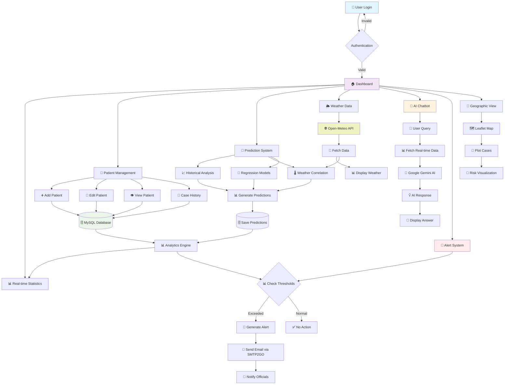
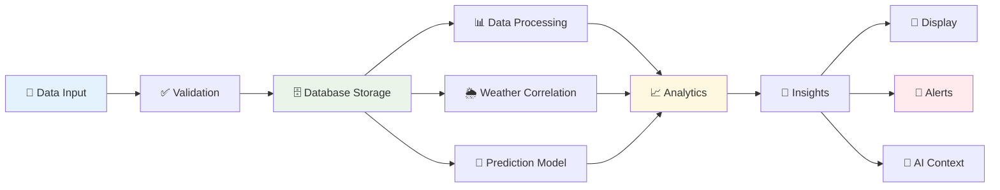
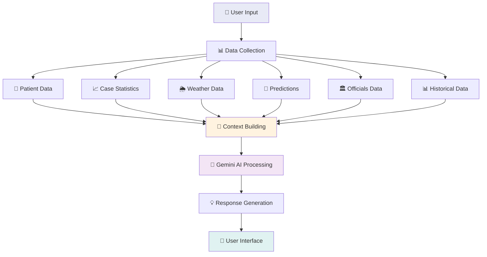
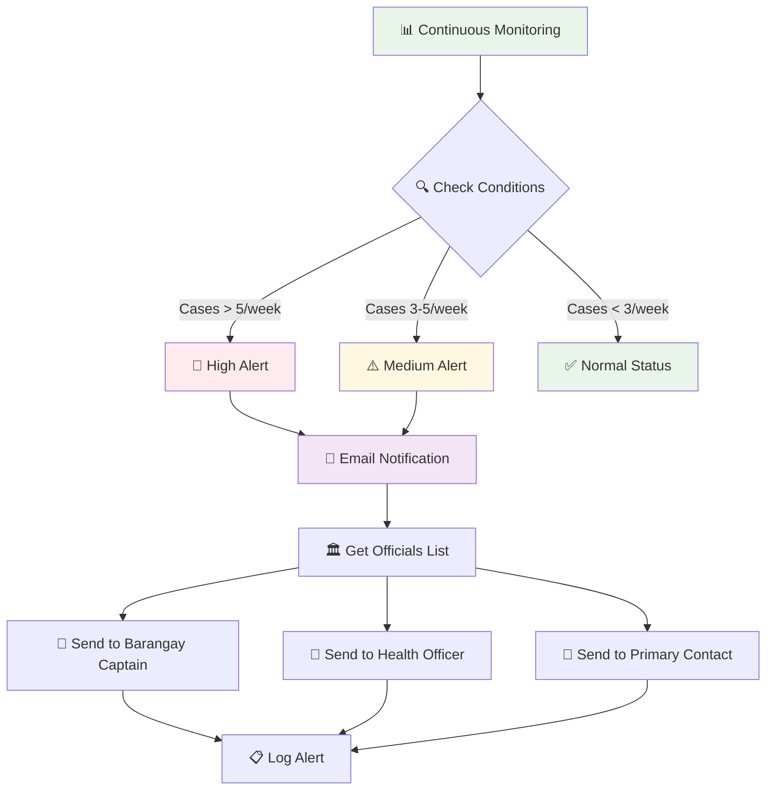
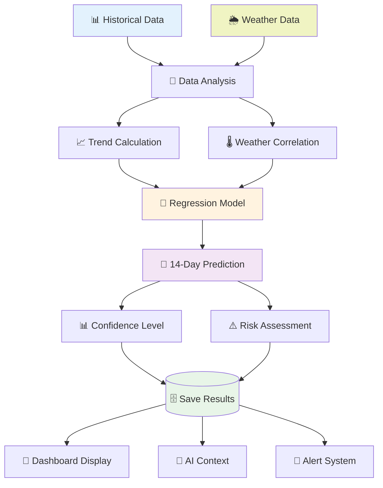
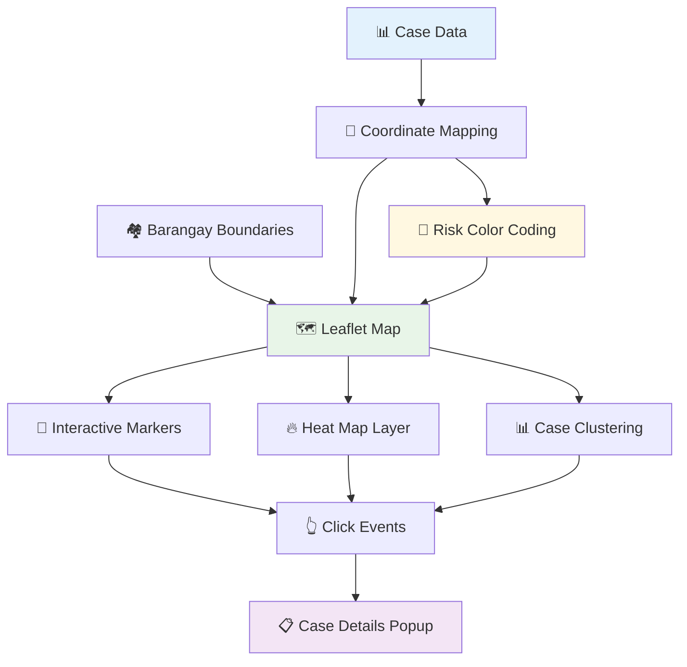
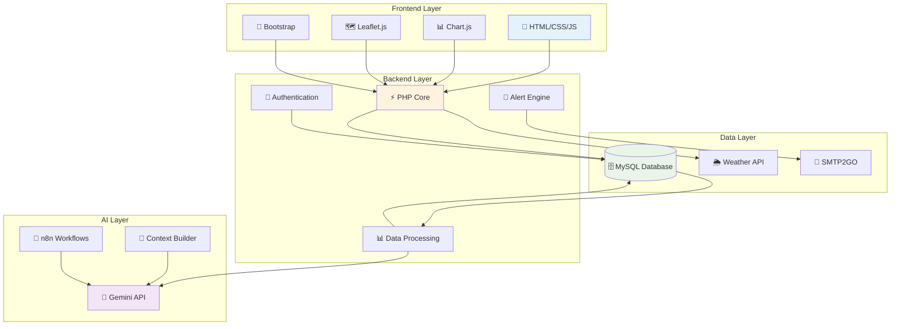
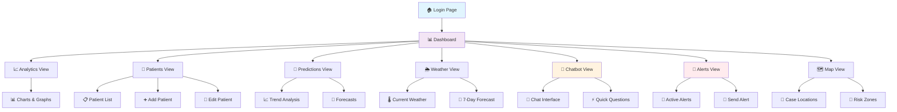

# 🏥 ASCLEPIUS Dengue Monitoring System - Flow Diagram

## 📊 **Main System Flow**

## 🔄 **Data Processing Flow**

## 🤖 **AI Chatbot Processing Flow**

## 🚨 **Alert System Flow**

## 📈 **Prediction System Flow**

## 🗺️ **Geographic Visualization Flow**

## 🌐 **System Architecture Overview**

## 📱 **User Interface Flow**

---

## 🔄 **Complete System Workflow Summary**

1. **🔐 Authentication** → User login and session management
2. **📊 Data Collection** → Patient cases, weather, historical data
3. **🔢 Processing** → Analytics, predictions, correlations
4. **🤖 AI Integration** → Intelligent responses and insights
5. **📱 Visualization** → Dashboard, maps, charts
6. **🚨 Monitoring** → Alert thresholds and notifications
7. **📧 Communication** → Email alerts to officials
8. **🔄 Feedback Loop** → Continuous data updates and improvements

This flowchart represents the complete ASCLEPIUS system architecture and data flow! 🎯